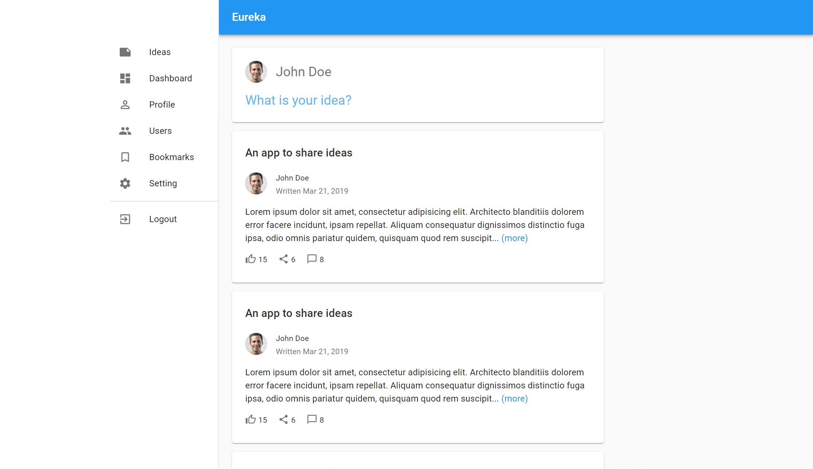
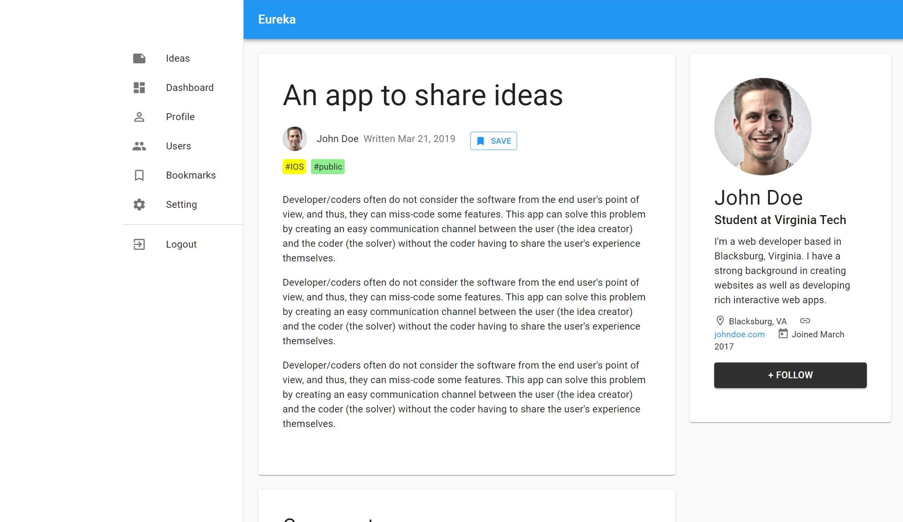

# Eureka
An idea sharing platform where both the developers and general public can propose app idea. [Visit](https://eureka123.herokuapp.com/)

### Project Overview

#### Concept:

People face problems in their everyday life. And they often have the solution to those problems. However, most people lack the technical expertise to make that idea come to life. 

This is what Eureka tries to solve!

Eureka is an idea sharing platform where both the developers and general public can propose app idea. The general public can state the problem they are experiencing and propose an app idea with possible features. The developer can then pick up the idea that they like and make it into an open source app. 

#### Problems it address:

1) Developers often do not consider the software from the end user's point of view, and thus, they can miss-code some features.
This app can solve this problem by creating an easy communication channel between the user (the idea creator) and the coder (the solver) without the coder having to share the user's experience themselves.

2) Developers have trouble finding open source projects to contribute to. With Eureka, they can easily find such projects, and help out the dev community. The developers can also team up with each other.

#### Features:

- People can create posts about wanting an app that can solve a problem they are experiencing.
- Other people can then upvote their ideas.
- Developers can develop apps by picking the ideas they really like
  - The developer who picks up this idea can link their app (Github reps) under the idea post.
  - Other developers can help in the creation of this app, thus, encouraging collaboration.

### (Desktop) UI

##### /ideas


##### /ideas/:id


##### /user/:id


### Development Status

The basic functionality of the app is complete.

### How to run the it locally?
- ``` npm install ```
- ``` npm run client ``` (run front-end)
- ``` npm run server ``` (run back-end)
- ``` npm run dev ``` (run both back-end and front-end)

### config/keys_dev.js needs to be created:
```
module.exports = {
  mongoURI: "CHANGE_ME",
  jwtSecret: "CHANGE_ME"
};
```

